# How to train your Object Detection Model using Tensorflow GPU in Linux

*This Tutorial is base on the [link](https://github.com/EdjeElectronics/TensorFlow-Object-Detection-API-Tutorial-Train-Multiple-Objects-Windows-10) that's for windows OS I changed some commands and codes for Linux*

## 1. Install Anaconda
Install Anaconda (Python 3) from [link](https://www.anaconda.com/distribution/#download-section)

<p align="center">
  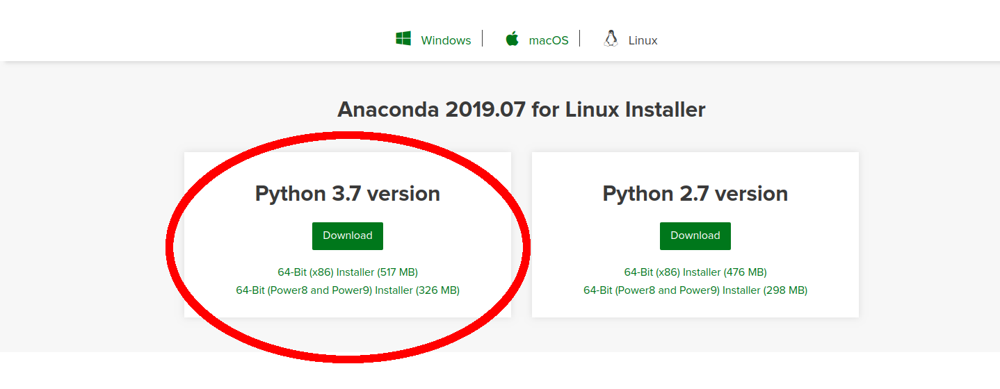
</p>

## 2. Download and install Cuda 10 and Download and set Cudnn 7.6
Follow the [link](https://medium.com/@vitali.usau/install-cuda-10-0-cudnn-7-3-and-build-tensorflow-gpu-from-source-on-ubuntu-18-04-3daf720b83fe)

## 3. Create environment: 

```
conda create --name tensorflow_gpu
```

## 4. Active environment
```
conda activate tensorflow_gpu
```
## 5. Install the required libraries:
Run the following commands:
```
conda install pillow
conda install lxml
conda install cython
conda install contextlib2
conda install jupyter
conda install matplotlib
conda install pandas
conda install opencv
conda install tensorflow-gpu
```
## 6. Test the installation 
Type python to open a python shell (Make sure you are in virtual environment)
```
import tensorflow as tf

hello = tf.constant('Hello, TensorFlow!')
sess = tf.Session()
print(sess.run(hello))
```
if you see the ``` b'Hello, TensorFlow!'``` output, you are good to go to the next step 

## 7. Download Tensorflow models form GitHub
Clone [link](https://github.com/tensorflow/models)
Rename the folder to models

## 8. Adding folders to models
Go to ```models/research/object_detection``` and create ```images``` and ```inference_graph``` and ```training``` folders

<p align="center">
  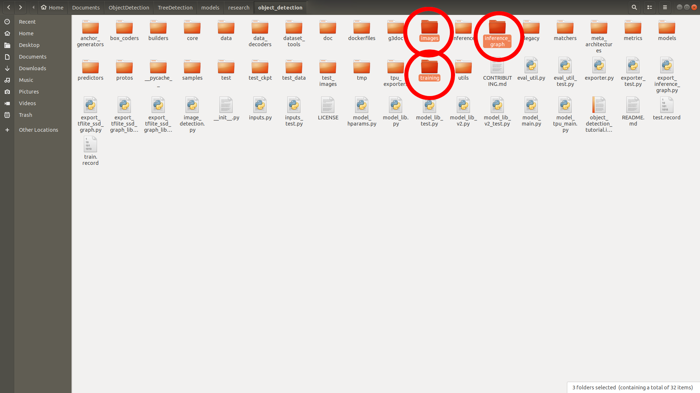
</p>

Clone this repository and paste files in  ```models/research/object_detection``` 

<p align="center">
  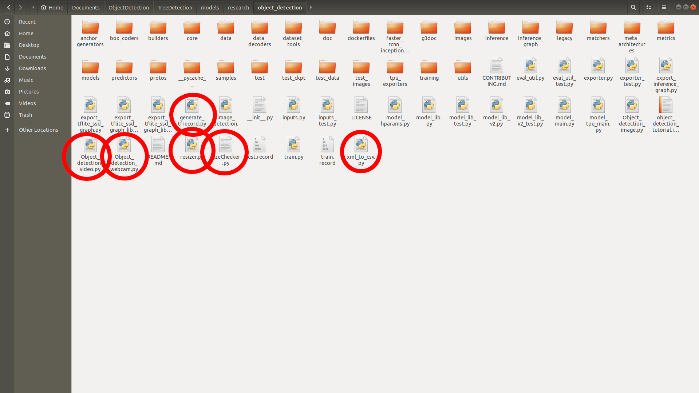
</p>

## 9. Download your tensorflow zoo models from GitHub 
Go to [link](https://github.com/tensorflow/models/blob/master/research/object_detection/g3doc/detection_model_zoo.md) and download your desire tensorflow zoo models.

<p align="center">
  
</p>

***Help: At COCO-trained models, you can choose your model that has the more ```COCO mAP[^1] ``` needs more time and higher GPU but higher performance.***

Extract it in ```models/research/object_detection``` folder

## 10. Set Python Path
Goto ```models/research``` and run the command to set the python path (make sure to run the command in ```research``` dir)

```
export PYTHONPATH=$PYTHONPATH:`pwd`:`pwd`/slim
```

## 11. Download protoc 
Download protoc from [GitHub](https://github.com/protocolbuffers/protobuf/releases)

Extract the file and copy ```protoc``` file in ```bin``` folder to your ```models/research``` directory and run the command

```
protoc object_detection/protos/*.proto --python_out=.
```
## 12. Run the commands:
In ``````models/research`````` directory run the command
```
python setup.py build
python setup.py install
```
## 13. Copy your image in train and test directory
In images folder ``````models/research/object_detection/images`````` create two directories name ```train``` and ```test``` 

<p align="center">
  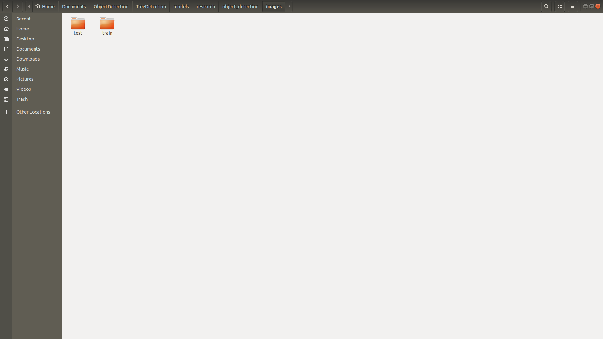
</p>

Copy 20% all images in the test and 80% in train directory 

***Notes: make sure your images are not too large it may kill the training (Use ```resizer.py``` and ```sizeChecker.py``` to resize and check your image size)***

## 13. Download and Run Labelimg
Go to this [GitHub page](https://github.com/tzutalin/labelImg#ubuntu-linux) and download Labelimg for labeling images

***Install guid: clone repository and run the following command in repository directory***

<p align="center">
  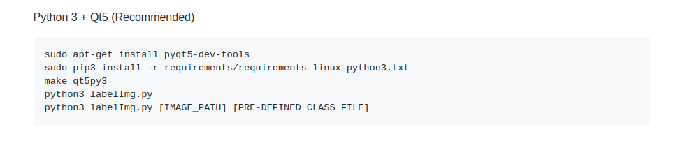
</p>

## 14. Label your images
Run the following command to run Labelimg
```
python labelImg.py
```
Set directory for train and test and start labeling images 

<p align="center">
  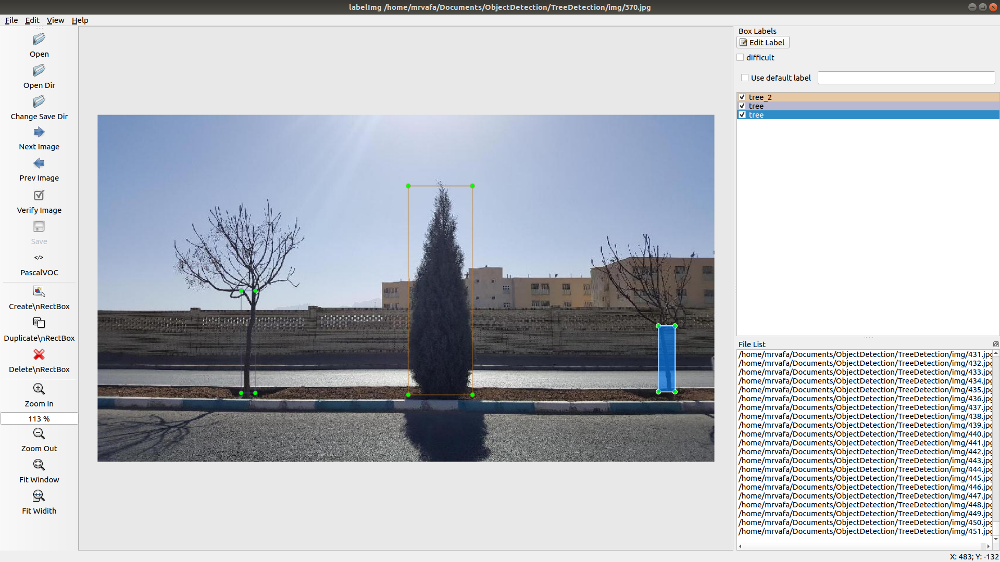
</p>

## 15. Convert XML to CSV
Run the command in ```models/research/object_detection/``` directory to convert your XML to CSV

```
python xml_to_csv.py
```
## 16. Create Train and Test label 
In ```models/research/object_detection/``` directory open ```generate_tfrecord.py``` with a text editor and set your label in ```class_text_to_int``` function then run the command to create labels file

```
python generate_tfrecord.py --csv_input=images/training --image_dir=image/train --out_path=train.record

python generate_tfrecord.py --csv_input=images/testing --image_dir=image/test --out_path=test.record
```
## 18. Create labelmap

Create ```labelmap.pbtxt``` in ```models/research/object_detection/training``` directory and write your label for example:

```
item {
id: 1
name: 'your-item-1'
}

item {
id: 2
name: 'your-item-2'
}

item {
id: 3
name: 'your-item-3'
}

item {
id: 4
name: 'your-item-4'
}

item {
id: 5
name: 'your-item-5'
}

item {
id: 6
name: 'your-item-6'
}
```
## 19. Set the config file
Go to ```models/research/object_detection/samples/config``` and copy your tensorflow zoo model and paste it in ```models/research/object_detection/training``` folder

<p align="center">
  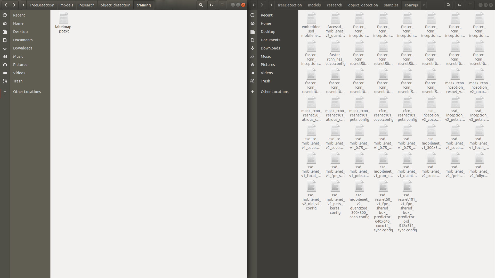
</p>

## 20. Edit config file
Set ```num_classes``` to your class numbers
Set ```fine_tune_checkpoint``` path to ```model.ckpt``` in your tensorflow zoo model directory
In ```train_input_reader``` block set ```input_path``` to point to ```train.record``` and ```label_map_path``` to ```labelmap.pbtxt```
Set ```num_examples``` to number of images in testing directory
In ```eval_input_reader``` block set ```input_path``` to point at ```test.record``` and ```label_map_path point``` to ```labelmap.pbtxt```

## 21. Finally start training

Goto legacy folder and run the command to start training
```
python train.py --logtostderr --train_dir=../training/ --pipeline_config_path=../training/<your-tensorflow-zoo model>.config
```
The train starts at a high loss and it will become low after training. The lower loss the better image detector.

***Notes: tensorflow will save training after 5 minutes when you taught training is enough,  press ```ctrl + c``` to end training***

<p align="center">
  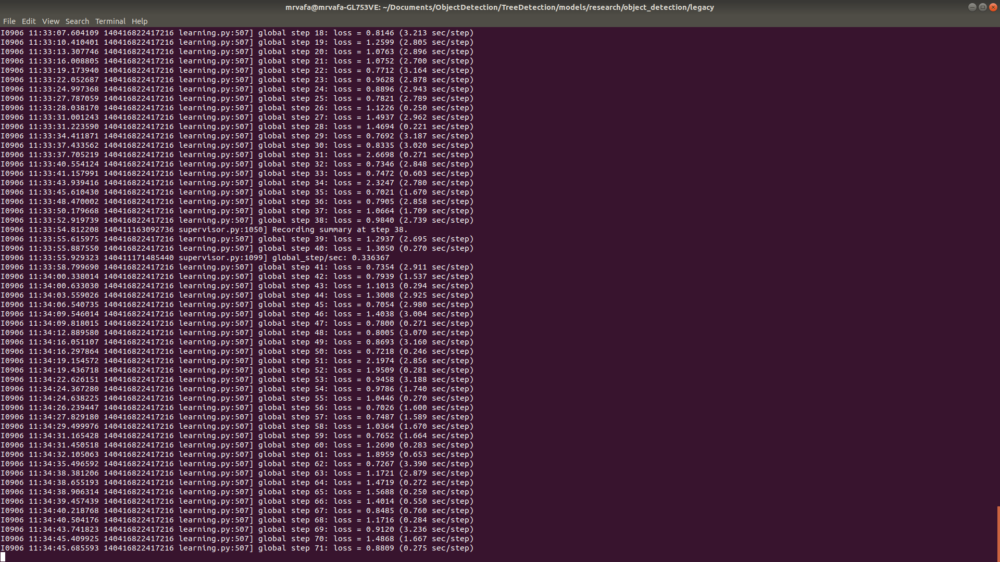
</p>

## 22. See the procsees
After the training procsees starts you can see the process by running the command bellow (in ```object_detection``` folder)
It shows amount of loss in training duration.
```
tensorboard --logdir=training/
```

<p align="center">
  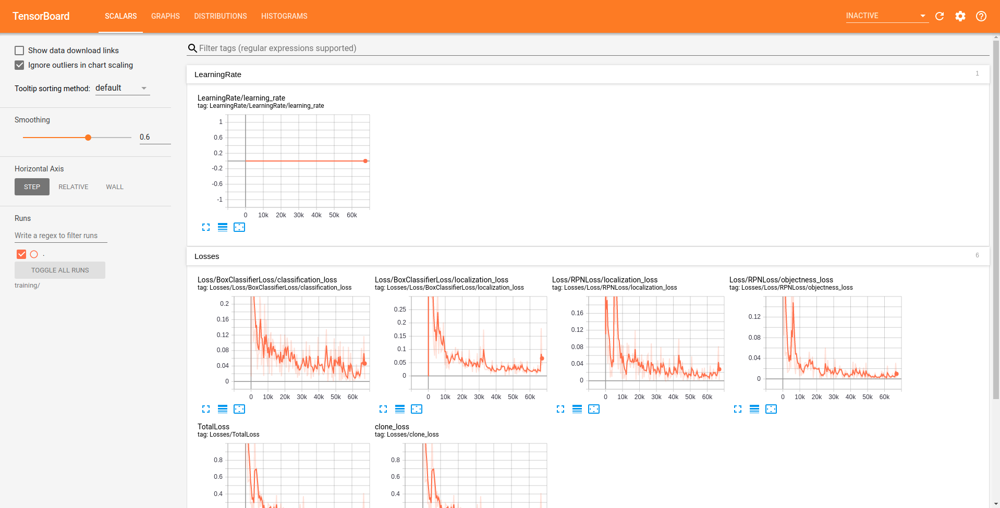
</p>

## 23. Create *.pb file 
Go to ```models/research/object_detection/training``` directory and find the highest number of ```model.ckpt-<highest-number>```

<p align="center">
  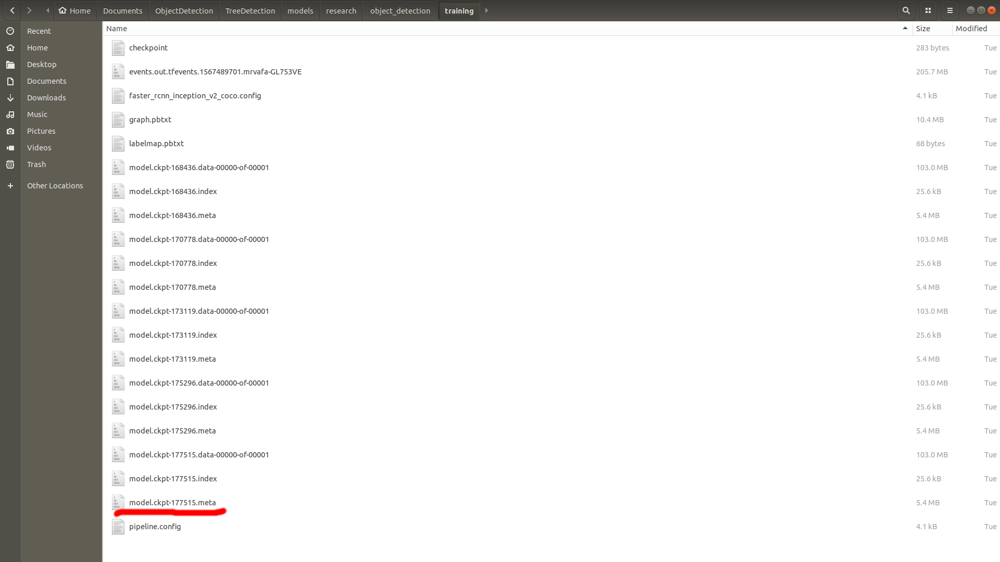
</p>

When the train complete (loss amount is nearly 0) goto ```object_detection``` folder and run the command
Replace ```<higest-number>``` with number you found in ```models/research/object_detection/training``` directory (mine 177515)

```
python export_inference_graph.py --input_type image_tensor --pipeline_config_path training/<your-tensorflow-zoo model>.config --trained_checkpoint_prefix training/model.ckpt-<higest-number> --output_directory inference_graph
```
## 24. See your result

### 24.1 Test with images
Now open ```Object_detection_image.py``` with text editor and replace ```NUM_CLASSES``` with your classes number
Then create folder name ```test_img``` in ```object_detection``` and copy images you want to test your Object Detection
Run the following command
```
python Object_detection_image.py
```
press ```q``` to exit image and open next image

<p align="center">
  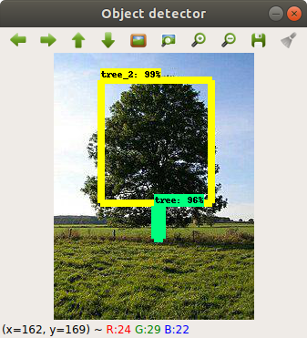
</p>

### 24.2 Test with videos
Open ```Object_detection_video.py``` and set ```NUM_CLASSES```
create folder name ```test_video``` directory in ```object_detection``` and copy videos you want to test your Object Detection
Run the following command
```
python Object_detection_video.py
```
press ```q``` to exit video and open next video

### 24.3 Test with Webcam
Open ```Object_detection_webcam.py``` and set ```NUM_CLASSES```
Run the following command
```
python Object_detection_webcam.py
```
press ```q``` to exit

## License & copyright
© MRVAFA
Licensed Under [Apache License Version 2.0](LICENSE)